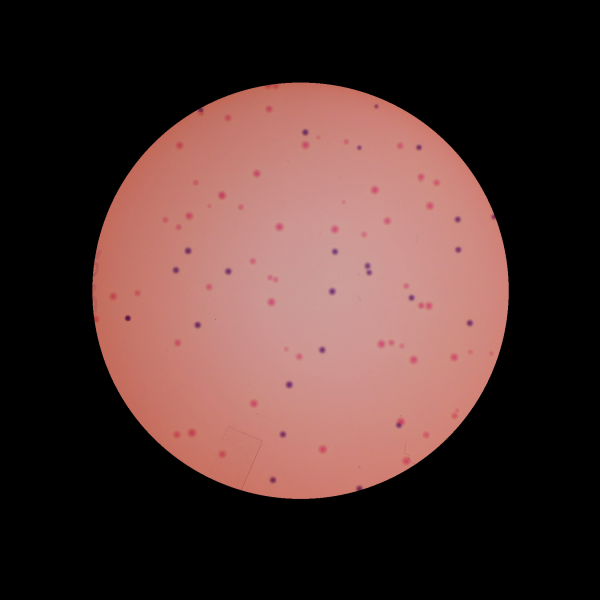
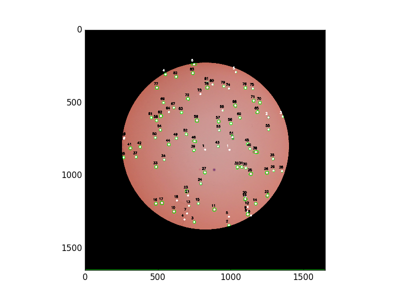

```{r setup, include=FALSE}
knitr::opts_chunk$set(echo = TRUE, comment = "#>")
```

### Fool's Gold: A foray into image analysis



Manual enumeration is tedious, time-consuming, and as a biologist, almost certainly unavoidable. 
In this case, the objective is to count the number of two differently colored bacterial colonies,
though this problem could be generalized to enumeration of any discrete objects (flourescent
cells, proteins, etc.) K-means group is designated by text color (black or white).


The script workflow is as follows:
  1. Create image copy in grayscale
  2. Denoise/blur
  3. Identify continous regions
  4. Watershed 
  5. Centroid calculation 
  6. K-means binning of each centroid

```{bash, eval=F}
python2 /home/dalgarno/Documents/GAW/final-projects/plate_counter.py
```




Lack of hue contrast between colonies and the agar is the ultimate source of error. In order to
register even modestly-sized colonies, the segmentation threshholds must be set very low, introducing
false-positives. As non-colonies are counted (e.g. ridges on the plate), their RGB values
are included in the K-means analysis. As a result, the different colony colors are binned into
one cluster, while non-colony hues, which are often quite disparate, are binned into another.

I wrote this script intending streamline and improve reproducibility of bacterial colony counts.
The finished product took dozens of hours and is out-performed by children with meager math and
color-identification capabilities. I would very much like to see Facebook/Google/NSA developers
spend 15 minutes over lunch to create an actually usable implementation.


